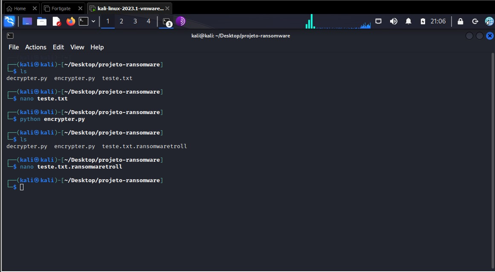
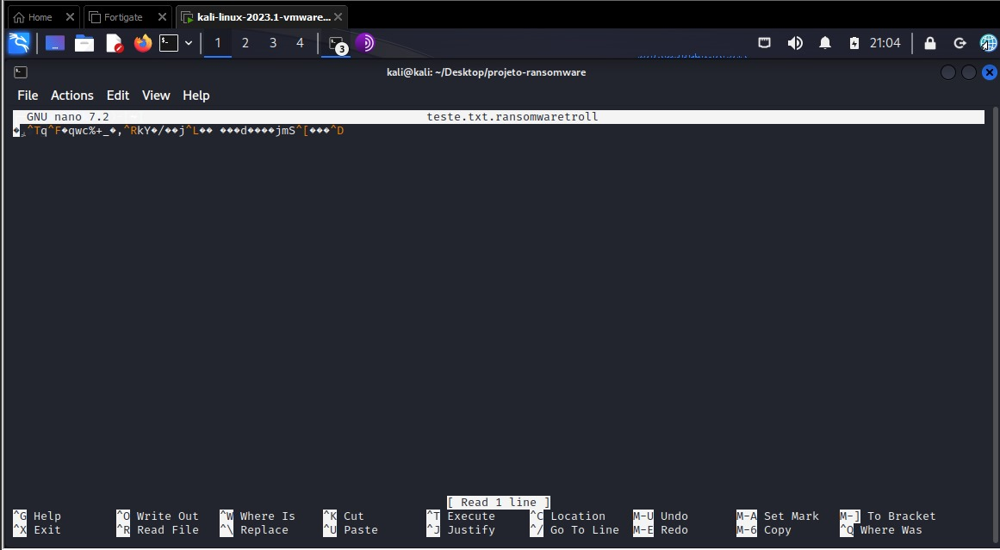
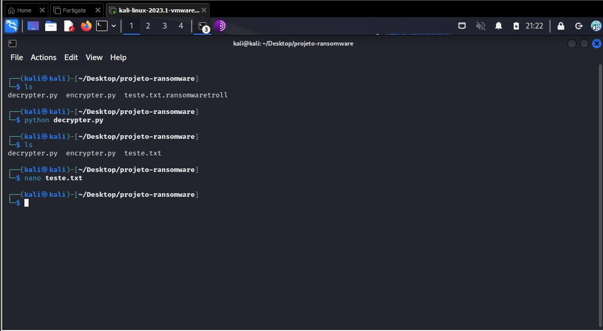
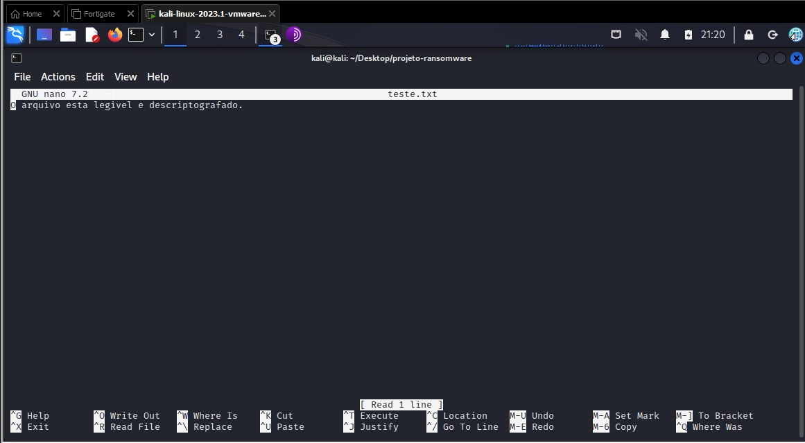

CYBERSECURITY DESAFIO RANSOMWARE

-> Introdução

  Este projeto tem como objetivo simular a implementação de um Ransomware usando a 
linguagem Python. 

-> Ferramentas

  - Kali Linux
  - Python 
  - Biblioteca Pyaes ( pip install pyaes )

-> Criação do Encriptador Utilizando Python

  

-> Resultado do Arquivo Criptografado

  

-> Criação do Descriptador Utilizando Python

  

-> Resultado do Arquivo Descriptografado

  

  
